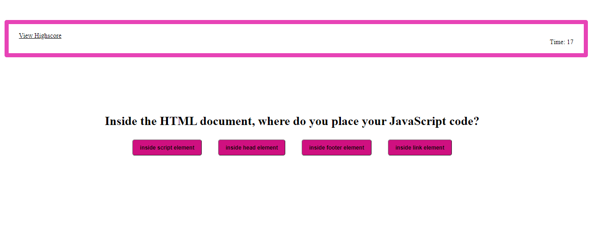

# Javascript Quiz!

## DESCRIPTION 📖:
This is a quiz application using HTML, CSS, and Javascript. This application emphasizes the use of Javascript to provide quiz questions and collects user data to determine whether the answers to a question are correct, this then generates a score and appends a final page of results from the user data.

## PROCESS:
* Add Event Listener.
* Timing Events (setInterval/clearInterval).
* Added Functions Declarations.
* Added Loops to repeat a sequence of instructions given.
* Added JSON.parse.
* Added JSON.stringify.
* Data is saved into Local Storage.
* Created elements to HTML with Javascript.

## FINAL RESULTS:

### LINK TO DEPLOYED URL :
[Javascript Quiz](https://abanae.github.io/Javascript-Quiz/index.html)
